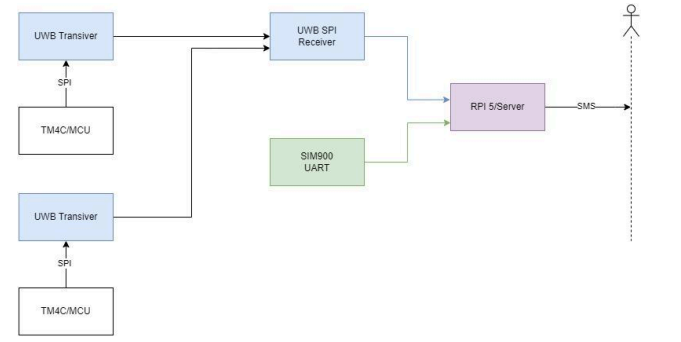
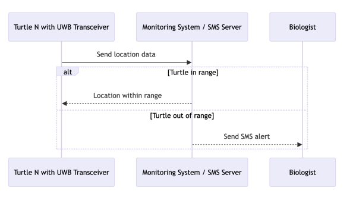
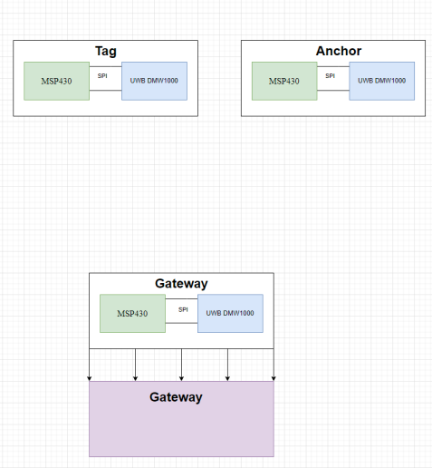
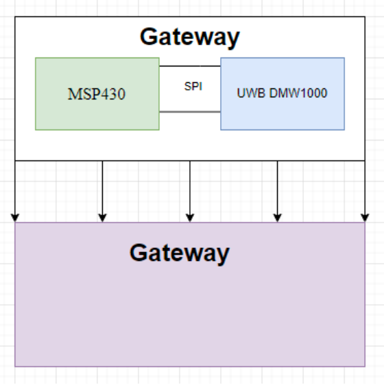

# Senior Capstone: Turtle Tracking Project

## Introduction

The Turtle Tracking Project is a collaboration with the Washington Department of Fish and Wildlife (WDFW) and Texas Instruments (TI). Approximately 30 to 40 Endangered Northwestern Pond Turtles are monitored within an approximate 60 meter by 60 meter habitat. The WDFW needs to locate eggs laid by female turtles and transfer them to zoos for raising. The process of tracking the turtle eggs is laborious and time-consuming, requiring personnel to triangulate the position of Passive Integrated Transponders (PIT) tags on each turtle and then collect the eggs. This project seeks to offer a less labor-intensive method of tracking turtles and alerts WDFW when turtles have potentially laid eggs.

## Proposed Solution

The proposed project solution is a Ultra-wideband (UWB) network spanning over the Turtle habitat. The network will consist of 4 or more anchor points surrounding the habitat and each Turtle will be equipped with a lightweight, low-profile UWB tag. The system will be driven by a Raspberry Pi computer, which communicates with one UWB anchor through Bluetooth and pings for the locations of each UWB tag. Once the Raspberry pi has the location of a tag and detects an area where turtles require attention from WDFW biologists, it sends an SMS to the biologists about their whereabouts.

## System Overview

### Figure 1: Represents the high-level system overview

For the high-level system design of the Turtle Tracking Project, we can break down the system into 3 subsystems, which are the UWB Transceiver tags, the monitoring system, and finally the SMS system.

### Figure 2: Represents the Monitoring System

### Power Supply
The UWB tags will be powered by a 3.3 voltage coin cell which will power the MCU and UWB chip on the Tag printed circuit board. The UWB anchors and Raspberry Pi Computer will be powered using on-site outlets and no maintenance should be required for the power supply of these stationary parts. The coin cell of the UWB tags should be changed out with charged cells at
least once per year or whenever convenient.

### Ultra Wide Band (UWB) Transceiver
An Ultra Wide Band Transceiver system is attached to each turtle in the habitat. These systems contain an antenna that can both send and receive data via ultra-wideband, sending the position data of a turtle to the base station at a set interval. Each tag is driven by an MSP430fr2476 microcontroller.

### Figure 3: Initial Circuit Diagram of System

### Figure 4: Initial Gateway Circuit Diagram of System

### MSP430fr2476 MCU

The main goal of our microcontroller is to interface with the UWB transceiver to process the data and handle communication protocols. It will handle pings from the Raspberry Pi for location data and gather the distance between itself and the anchors. An MSP430 microcontroller was chosen due to its advertised low-power modes.

### UWB Anchor

UWB anchors are afforded a higher profile and weight capacity due to being stationary and not attached to turtles. DWM1001 development boards are utilized here due to having readily available housing and equipment to run the boards. The UWB anchors will wait for distance queries from UWB tags and send their distance between themselves the tag.

### Monitoring System

The monitoring system consists of the RPI5/ SPI communication and UWB Receiver. This module will be designed to detect and read information from the UWB modules. It will read the position data of each turtle and perform calculations to determine their locations. Once a turtle has left the defined pond area, the system will then use the SMS system to notify the
biologists.

### SIM900 Module

This module is connected to the RPi server via the Universal Asynchronous Receiver-Transmitter (UART) interface and provides connectivity and or GSM functionality to help the internet.

### SMS System

For our SMS system, we are using a Linux-based server. Ubuntu is our go-to right now since we are more familiar with it. Initially, we will be using the AWS EC2 instance since we have a free student account. We will set up our Linux server and then use NGINX as a reverse proxy so we can host our SMS system using the Twilio SMS service. We also could use only GSM because of the SIM900 however, it would cost a lot of money to send SMS using GSM.

### Figure 5: Schematics of UWB Tag PCB

This is the schematic of the custom PCB we designed. The large square is the microcontroller, while the smaller one in the bottom right corner is the DWM 1000 chip. The board we designed is simple, the UWB chip is connected to the correct pins on the microcontroller. We broke out some of the important traces onto pin headers, and we added a reset switch for the microcontroller.

## Software Architecture

Similarly to the high-level system architecture, the software architecture will also be broken down into three parts: UWB Tag, UWB Anchor, and the Raspberry Pi Server.

### UWB Tag

The DW1000 chip also provides software drivers which only require platform-specific functions for SPI, sleep, and mutex lock on interrupts. The platform-specific functions are developed using TI's Code Composer Studio IDE and its implementations can be found in the platform folder of the “dw1000_api_msp430fr2476” on the GitHub repository.

### Rationale

Keeping the module simple and small, which is needed since they will be attached to the turtles. Modules need to be equal or less than 5% of the turtle’s body weight to follow the Washington Department of Fish and Wildlife guidelines.
        ● TM4 Microcontroller / other MCUs
        ● UWB chip
        ● Coin cell battery

### UWB Anchor

The DWM1001 development comes with pre-flashed firmware that works with the MDEK1001 app for quick setup of a UWB network that operates as a proof of concept but is not satisfactory for WDFW requirements. This is the current software on the UWB anchors and custom software still needs to be developed for the anchor.

### Raspberry Pi Server and Base Station

The Raspberry Pi serves as our server base station. With the help of a starter kit, we have built a graphical user interface (GUI) that can be accessed through a specific port to monitor the positions of the tags and anchors in real-time. One of the DWM1001 modules is connected to the Raspberry Pi using the SPI interface, allowing the Raspberry Pi to function as a gateway. This setup requires creating a custom Raspberry Pi kernel and updating the SPI kernel driver to ensure correct communication.

The software architecture on the Raspberry Pi includes the following components:
        ● GUI Module: This module provides a graphical interface for users to visualize and interact with the UWB network. It displays real-time positions of the tags and
        anchors and allows for system configuration and monitoring.        
        ● Data Collection Module: This module is responsible for communicating with the
        UWB Anchors via SPI to collect raw location data. It continuously listens for data
        packets and stores them temporarily.
        ● Data Processing Module: This module processes the raw data to calculate the
        precise positions of the UWB Tags. It includes algorithms for filtering, error
        correction, and triangulation.
        ● Database Module: This module stores the processed data into a database for future
        retrieval and analysis. SQLite is used for its simplicity and efficiency.
        ● Server Module: This module provides an interface for external clients to access the
        processed location data. It includes an HTTP server built javascript and some php
        for uploading the map .png file, allowing real-time data visualization and
        interaction through a web interface.
        ● Configuration Module: This module allows for system configuration and
        management. It includes functions for setting up network parameters, calibrating
        UWB Anchors, and updating firmware.
    
The integration of these components ensures that the Raspberry Pi Server can effectively manage the UWB network, process data in real-time, and provide accurate location
information. The modular design allows for easy updates and scalability, ensuring the system can adapt to future requirements and enhancements.

###Rationale
  We decided to use Raspberry Pi 5 since we can run the server directly on the system rather than have to pay for an external server. Cellular will most likely be the best option for an internet connection so that we can send SMS messages to the biologists. Need to determine if buildings on-site are close enough for external power supply. If not, then we will use a battery system.

