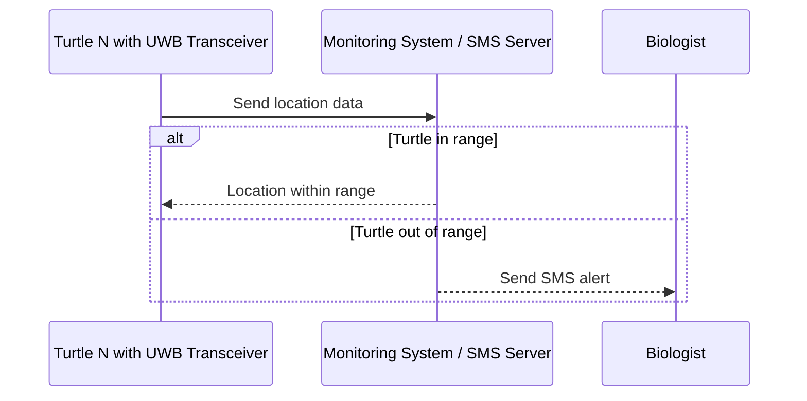
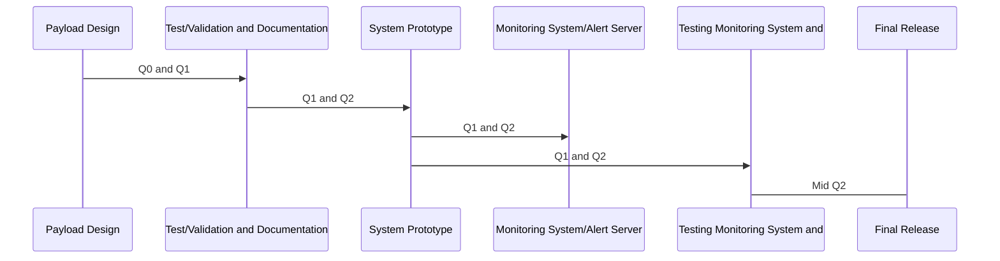
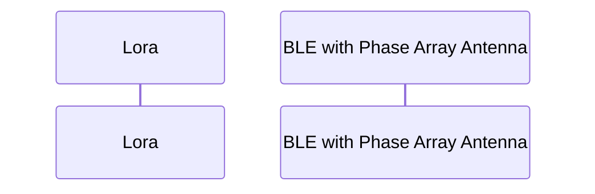

# Senior Design Project

## High Level System Overview

```mermaid

sequenceDiagram
    participant Turtle as Turtle N with UWB Transceiver
    participant MonitoringSystem as Monitoring System / SMS Server
    participant Biologist as Biologist

    Turtle->>MonitoringSystem: Send location data
    alt Turtle in range
        MonitoringSystem -->> Turtle: Location within range
    else Turtle out of range
        MonitoringSystem -->> Biologist: Send SMS alert
    end

```

## Project Roadmap

```mermaid
sequenceDiagram   
    participant Payload as Payload Design
    participant Test as Test/Validation and Documentation
    participant Prototype as System Prototype
    participant Monitoring as Monitoring System/Alert Server
    participant Test_Monitoring as Testing Monitoring System and 
    participant Final as Final Release

    Payload ->> Test: Q0 and Q1
    Test ->> Prototype: Q1 and Q2
    Prototype ->> Monitoring: Q1 and Q2 
    Prototype ->> Test_Monitoring: Q1 and Q2
    Test_Monitoring -> Final: Mid Q2
```

## Components

```mermaid
sequenceDiagram  
    participant Lora

    participant BLE with Phase Array Antenna


```

